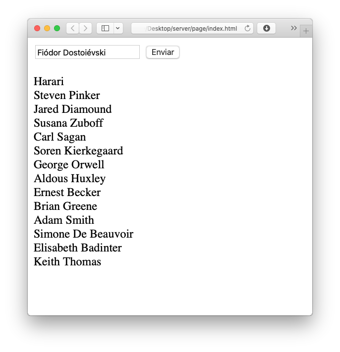

- NODE Connection:
```javascript
const mongodb = require("mongodb").MongoClient;

mongodb.connect("mongodb://localhost:27017/mydb", (error, db) => {
    if (error) throw error;
    exports.database = db.db("BANCO");
});
```

- Setting POST Route:
```javascript
app.post("/criar", (req, res) => {
    mongodb.database.collection("autores").insertOne({"nome":req.body.autor}, (err, res) => {
        if (err) throw err;
    });
});

- POST 
